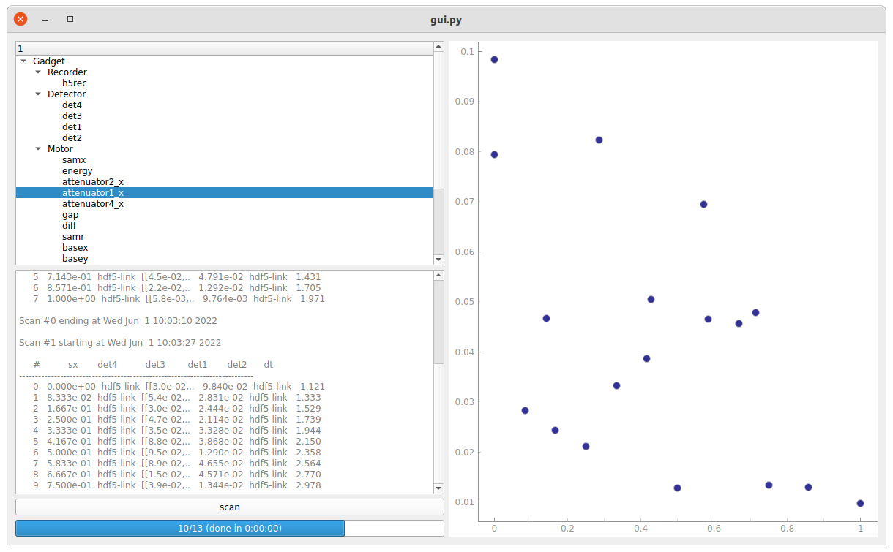

Making graphical user interfaces
================================

There are a number of ways one could imagine building graphical user interfaces (GUI:s) for contrast. The simplest would be to build a standalone GUI in some framework, which directly owns and operates on ``contrast`` objects. A more sophisticated way might be to implement a server/client system, either via a trivial listener or via the ``ipython`` kernel/client system. Then, multiple GUI clients written in any framework could connect to a central instance, perhaps facilitating remote operation.

Standalone GUI
--------------

The most straightforward way of writing a ``contrast`` GUI is probably to directly create ``contrast`` objects in the main GUI thread. As time-consuming operations (like scans) would block the GUI, these can be threaded. The beamline components are then specified in a separate file and imported. With PyQt5, the following is a minimal example. ::

    """
    An minimal contrast GUI which directly runs a beamline and does work
    in a separate thread. Just a button which runs a scan.
    """

    import sys
    from PyQt5.QtCore import QThread
    from PyQt5.QtWidgets import QWidget, QApplication, QPushButton
    from contrast.scans import AScan
    from contrast.motors import DummyMotor
    from contrast.detectors import DummyDetector

    mot1 = DummyMotor(name='mot1')
    det1 = DummyDetector(name='det1')

    class Example(QPushButton):

        def __init__(self):
            super().__init__('Push me to run a scan')
            self.clicked.connect(self.run_scan)

        def run_scan(self):
            self.runner = ScanRunner(AScan, *[mot1, 0, 1, 10, .1])
            self.runner.start()

    class ScanRunner(QThread):

        def __init__(self, scan_class, *args, **kwargs):
            super().__init__()
            self.scan_obj = scan_class(*args, **kwargs)

        def run(self):
            self.scan_obj.run()

    if __name__ == '__main__':
        app = QApplication(sys.argv)
        ex = Example()
        ex.show()
        ret = app.exec_()
        sys.exit(ret)

A richer example with a full beamline script file, progress bar, conversion of ``Recorder`` data to pyqt signals, redirection of ``stdout`` to the GUI, etc, can be found in ``beamlines/gui-examples/pyqt-standalone/gui.py``.

Server/client models
--------------------

A trivial listener
~~~~~~~~~~~~~~~~~~

Sometimes it might be useful to run a blocking server in the main ``IPython`` interpreter, which receives and executes commands. Using macro syntax, the following is a simple implementation of that. Let's call it the ``MacroServer``. ::

    """
    Simple server which listens to macros commands over zmq, and executes
    them in the current session.
    """

    import zmq
    from contrast.environment import runCommand, macro, env
    from contrast.motors import DummyMotor
    from contrast.detectors import DummyDetector
    from contrast.recorders import StreamRecorder
    import json

    PORT = 5678
    mot1 = DummyMotor(name='mot1')
    det1 = DummyDetector(name='det1')
    if __name__ == '__main__':
        rec = StreamRecorder(name='rec')
        rec.start()

    @macro
    class MacroServer(object):
        """
        Trivial server which takes macro commands and executes them.
        """
        def __init__(self):
            context = zmq.Context()
            self.socket = context.socket(zmq.REP)
            self.socket.bind("tcp://*:%s" % PORT)

        def run(self):
            while True:
                cmd = self.socket.recv().decode()
                runCommand(cmd)
                self.socket.send(json.dumps(env.lastMacroResult).encode())

On the client side, a GUI in any framework could execute commands and listen to the stream of the ``StreamRecorder``. Here's a simple client with no actual GUI. As with the standalone Qt GUI discussed above (see ``beamlines/gui-examples/pyqt-standalone/gui.py``), received data can easily be converted to (for example) pyqt signals in a reactive way. ::

    """
    Client which sends commands to a trivial server and gets data over the
    StreamingRecorder.
    """

    import zmq
    import json

    # set up the command socket
    context = zmq.Context()
    csocket = context.socket(zmq.REQ)
    csocket.connect("tcp://localhost:5678")

    # set up the data socket
    dsocket = context.socket(zmq.SUB)
    dsocket.connect("tcp://localhost:5556")
    dsocket.setsockopt(zmq.SUBSCRIBE, b"")  # subscribe to all topics

    # run a scan
    N = 10
    csocket.send(('ascan mot1 0 1 %u .1' % N).encode())

    # watch the data stream for progress
    data = []
    while len(data) < (N + 1):
        data.append(dsocket.recv_pyobj())
        print('%u/11\r' % len(data), end='')
    print('')

    # get the scan's return value to complete the REQ/REP scheme
    print('Macro result: %s' % json.loads(csocket.recv()))

One possible upside of this is that control has to be deliberately given up in the main ``IPython`` interpreter, and all output is displayed in the main window. It would be possible to attach differend GUI clients made for different purposes.

``IPython`` kernel clients
~~~~~~~~~~~~~~~~~~~~~~~~~~

A more elegant solution using remote calls to a central ``IPython`` interpreter running contrast, would be to use the ``jupyter-client`` library and a kernel running contrast. Then, multiple clients can execute any code in the kernel, and get any information throught the various ``zmq`` channels. There are examples of how this communication works under ``beamlines/gui-examples/kernel-examples``. But everything is sent as text, and there seems to be a large amount of parsing and other work needed to get this working nicely.
